# Architettura

Questo documento descrive lo stato attuale del codice. Quando una scelta
architetturale e il comportamento dell'interfaccia divergono, qui viene
documentato ciò che fa il codice, non ciò che il prodotto vorrebbe fare.

## Vista d'insieme

```mermaid
flowchart LR
    UI[Browser / client esterno]
    WEB[Controller e filtro HTTP]
    SVC[Servizi applicativi]
    REG[NpuDriverRegistry]
    DRV[NpuDriver Java]
    JNI[Native bridge JNI]
    RT[Runtime C++ / SDK vendor]
    NPU[Dispositivo NPU]

    UI --> WEB
    WEB --> SVC
    SVC --> REG
    REG --> DRV
    DRV --> JNI
    JNI --> RT
    RT --> NPU
```



Spring Boot contiene sia il control plane sia il data plane:

- il **control plane** rileva hardware, scarica modelli, carica/scarica il
  modello, abilita l'API e avvia task di setup;
- il **data plane** valida richieste Ollama/OpenAI, renderizza il prompt,
  seleziona il driver e inoltra la generazione al runtime nativo.

Non esiste un processo worker separato. Le librerie native sono caricate nello
stesso processo JVM e mantengono stato globale C++.

## Componenti Java

| Componente | Responsabilità | Da non metterci |
| --- | --- | --- |
| `core/model` | DTO interni immutabili ed enum dei backend | I/O, stato o logica HTTP |
| `core/driver/NpuDriver` | Contratto comune load/unload/generate/stream | Logica Ollama o gestione catalogo |
| `NpuDriverRegistry` | Registrazione, probe e selezione fail-closed | Caricamento di librerie o modelli |
| `core/driver/impl` | Adattamento tra contratto Java e firme JNI | Parsing delle richieste HTTP |
| `jni` | Firme native e ricerca/caricamento delle `.so` | Politiche di selezione hardware |
| `ModelManagementService` | Catalogo, path, quantizzazioni e singolo modello attivo | Rendering dei prompt |
| `OllamaModelService` | Nomi Ollama, alias persistenti, tag/show/digest | Inferenza |
| `OllamaInferenceFacade` | Validazione opzioni, prompt e stop sequence | Accesso diretto a JNI |
| `InferenceService` | Chiamata al driver, async streaming e metriche | Stato del modello |
| `HardwareDiscoveryService` | Probe e metriche Linux/JVM | Mutazioni hardware |
| `SetupService` | Comandi esterni asincroni di install/build | Richieste di inferenza |
| `web/controller` | Contratto HTTP e serializzazione | Dettagli degli SDK vendor |

## Ciclo di vita del modello e dell'API

Gli stati del modello e dell'API sono indipendenti:

```text
catalogo ──download──> presente su disco ──load──> caricato nella NPU
                                                   │
                                                   └── start API ──> inferenza abilitata
```

Regole effettive:

- esiste un solo `currentlyLoadedModelId` per processo;
- un secondo modello non sostituisce automaticamente il primo: il servizio
  solleva un errore finché il primo non viene scaricato;
- ricaricare lo stesso file con un contesto richiesto non superiore a quello
  attuale è un no-op;
- il modello viene caricato con contesto minimo 4096 su Rockchip e minimo
  assoluto 512;
- l'API parte disabilitata a ogni riavvio;
- `start` richiede un modello caricato;
- `stop` blocca gli endpoint principali ma non scarica il modello;
- `unload` scarica il modello ma non forza `enabled=false`;
- il `keep_alive` ricevuto dalle API viene analizzato, ma la facade lo ignora:
  la residenza è gestita esplicitamente dal pannello.

`InferenceApiGateFilter` restituisce `503` quando l'API è ferma per:

- `POST /api/chat`;
- `POST /api/generate`;
- `POST /v1/chat/completions`;
- `POST /v1/completions`.

Altri endpoint, incluso `/v1/responses`, non passano da questo gate specifico.
Possono comunque fallire se non c'è un modello caricato.

## Selezione del backend

`NpuDriverRegistry` registra tutti i bean `NpuDriver`.

Con backend esplicito:

1. confronta nome enum e display name senza distinzione tra maiuscole;
2. verifica `isAvailable()`;
3. fallisce se il backend richiesto non è sano.

Con `auto`, la priorità è:

1. Rockchip;
2. OpenVINO;
3. Qualcomm;
4. Ryzen AI.

Non è previsto fallback CPU/GPU. Se nessun driver è disponibile viene
sollevata un'eccezione.

La disponibilità prevista è la combinazione di un device Linux e una libreria
JNI:

| Backend | Check Java |
| --- | --- |
| Rockchip | runtime JNI e (`/dev/accel/accel0` oppure probe nativo) |
| OpenVINO | architettura `amd64`, `/dev/dri/renderD128`, JNI e probe OpenVINO |
| Qualcomm | `/dev/kgsl-3d0`, JNI e probe Genie |
| Ryzen AI | `/dev/amdxdna`, JNI e probe OGA |

Questi check non certificano da soli che un modello specifico sia compatibile.

Il probe Rocket corrente non è fail-closed: sia il worker reale sia lo stub
ritornano sempre `true` da `nativeCheckAccel0Available()`. Se il bundle JNI è
caricabile, Rockchip può quindi risultare raccomandato anche senza
`/dev/accel/accel0`. Il load successivo fallirà se il backend Rocket non riesce
a inizializzare il device. Anche la versione `"1.6.0"` esposta dal worker è un
placeholder, non una lettura del driver installato.

## Confine JNI e caricamento librerie

Le firme Java sono in `src/main/java/com/npuhub/jni`. I simboli C++ devono
corrispondere esattamente al package, alla classe, al nome del metodo e ai
parametri. Una modifica unilaterale può compilare sia Java sia C++ e fallire
solo a runtime con `UnsatisfiedLinkError`.

Per Rockchip, `NativeLibraryLoader` tenta prima il bundle coerente contenuto nel
JAR:

```text
/native/rocket/libggml-base.so.0
/native/rocket/libggml.so.0
/native/rocket/libllama.so.0
/native/rocket/libggml-cpu.so
/native/rocket/libggml-rocket.so
/native/rocket/libnpu_rockchip_jni.so
```

Il bundle viene estratto in una directory temporanea e le dipendenze principali
sono caricate in ordine. In assenza del bundle, il loader prova:

1. `java.library.path`;
2. `native/build`;
3. una singola risorsa `/native/<nome-libreria>`.

Per gli altri backend l'ordine parte direttamente da questi tre tentativi. Di
conseguenza una libreria di sistema obsoleta può precedere quella nel JAR.

### Implementazioni reali e stub

`native/` produce quattro librerie semplici. OpenVINO, Qualcomm e Ryzen AI
restituiscono testo simulato; lo stub Rockchip è inoltre incompatibile con le
firme di sampling estese e con il callback di log correnti.

Le implementazioni reali sono:

- `workers/rocket/src/rocket_jni.cpp`;
- `workers/openvino/src/openvino_jni.cpp`;
- `workers/ryzenai/src/ryzenai_jni.cpp`.

`tools/build-all.sh` sostituisce lo stub Rockchip con il runtime Rocket reale,
ma impacchetta ancora gli stub generici per gli altri backend. Chi interviene
sulla build deve preservare questa distinzione o, preferibilmente, introdurre
profili espliciti che non possano simulare accidentalmente una NPU reale.

## Runtime Rocket

Rocket usa `llama.cpp` e carica dinamicamente i backend GGML CPU e ROCKET.

Caricamento modello:

1. configura modalità ibrida o strict;
2. abilita il backend Rocket;
3. carica il GGUF;
4. crea il contesto con `n_ctx`, `n_batch`, `n_ubatch` e tipo KV;
5. se una KV cache quantizzata fallisce, riprova con `f16`.

Generazione:

1. tokenizza il prompt con il vocabolario del modello;
2. compatta head/tail se il prompt non entra nel contesto;
3. riusa il prefisso KV quando possibile;
4. esegue il prefill a chunk;
5. costruisce la sampler chain;
6. campiona, decodifica e invia i token;
7. invalida la cache in caso di errore.

Il codice Java sincronizza `load`, `unload`, `generate` e `generateStream` per
istanza di driver. Questo serializza le operazioni su ciascun backend, anche se
lo streaming viene avviato da un executor con quattro thread.

## Modelli

Il catalogo è inizializzato in `ModelManagementService.initCatalogModels()`.
Contiene metadati e path relativi; non è un database.

Path:

- la proprietà `npu.models.directory` vale `models` per default;
- i path di catalogo che iniziano con `models/` vengono rimappati sotto quella
  directory nei flussi di discovery, download e risoluzione Ollama;
- Rockchip usa file `.gguf` e può avere più quantizzazioni nella stessa
  directory;
- OpenVINO, Qualcomm e Ryzen AI usano directory modello.

Il load diretto non-Rockchip passa ancora `metadata.path()` al driver senza
chiamare `resolveConfiguredPath()`. Con `npu.models.directory` diverso da
`models`, download e discovery possono vedere il modello mentre il driver
riceve il vecchio path relativo. È un punto da correggere prima di dichiarare
supportato un models root personalizzato per quei backend.

Per Rockchip:

- la quantizzazione raccomandata è `Q4_K_M`;
- un nome Ollama può usare il tag `:Q4_K_M`;
- il file viene selezionato cercando la quantizzazione nel filename;
- il context length viene letto dai metadati GGUF quando disponibile.

Il downloader considera presente un modello solo oltre 50 MiB. Non verifica
checksum, firma o contenuto del modello.

Le directory non presenti nel catalogo vengono scoperte in modo euristico:
nomi contenenti `-ov` diventano OpenVINO, tutti gli altri Qualcomm. Questa
euristica non registra automaticamente nuovi repository GGUF Rockchip.

## Alias Ollama

`OllamaModelService` implementa alias leggeri creati da `/api/create` e
`/api/copy`. Vengono salvati, per default, in:

```text
.npuhub/ollama-models.json
```

Un alias può aggiungere template, system prompt, parametri e messaggi iniziali,
ma non duplica i pesi. Gli alias ciclici vengono rifiutati in risoluzione. Un
file alias corrotto viene ignorato all'avvio; non blocca il server.

## Preparazione del prompt

`OllamaInferenceFacade` è il punto comune tra Ollama e OpenAI:

- unisce parametri dell'alias e opzioni della richiesta;
- verifica che il modello richiesto sia proprio quello già caricato;
- rifiuta immagini;
- rende prompt Phi, Gemma o un formato generico;
- inserisce tool e vincoli JSON come istruzioni testuali;
- rimuove i turni completi più vecchi quando la stima supera il budget;
- applica le stop sequence sul testo emesso.

Il conteggio usato per compattare la chat è una stima basata sui byte UTF-8,
non il tokenizer reale. Rocket applica una seconda protezione token-level.

Parametri inoltrati integralmente solo a Rocket:

```text
temperature, top_p, top_k, min_p, seed, repeat_last_n,
repeat_penalty, frequency_penalty, presence_penalty
```

Gli altri driver ricevono solo `temperature`, `top_p` e `max_tokens`.

## Concorrenza e stato

Lo stato è interamente process-local:

- modello caricato;
- API enabled/disabled;
- impostazioni UI;
- progress dei download e dei task;
- log del pannello;
- metriche correnti/ultime.

Non c'è coordinamento tra più istanze dell'applicazione. Due processi sulla
stessa NPU o sulla stessa directory modelli possono interferire.

`InferenceService` usa un pool fisso di quattro thread per lo streaming. Il
valore UI `maxConcurrentInferences` non configura questo pool. I metodi dei
driver sono sincronizzati e i runtime C++ usano stato globale, quindi il
parallelismo effettivo è limitato e non va aumentato senza riprogettare lo
stato nativo.

`InferenceMetrics` pubblica una vista process-wide dell'operazione corrente o
dell'ultima completata. Con più richieste contemporanee, `CURRENT` rappresenta
una sola misura e non è una sorgente per accounting preciso.

## Frontend

La pagina `templates/index.html` è renderizzata con Thymeleaf. I dati dinamici
successivi arrivano da `static/js/app.js`, che:

- interroga hardware, diagnostica, modelli e log;
- gestisce download/load/unload;
- abilita o ferma l'API;
- consuma lo stream NDJSON di `/api/chat`;
- salva impostazioni process-local.

Non c'è pipeline frontend. Le librerie `marked` e `DOMPurify` sono vendorizzate
sotto `static/vendor`.

## Osservabilità

`HardwareDiscoveryService` legge:

- `/proc/stat` per la CPU;
- `/proc/meminfo` per RAM e swap;
- runtime power management sotto `/sys/devices/platform/*.npu/power` per la
  percentuale Rockchip;
- JVM e device node per le altre informazioni.

`LogService` conserva al massimo 2000 record in memoria. Non intercetta
automaticamente tutti i log SLF4J: contiene solo eventi aggiunti esplicitamente
dai servizi e dal callback Rocket.

## Debito tecnico da considerare

- nessun test unitario, di integrazione o hardware;
- API amministrative non autenticate e CORS `*`;
- setup remoto capace di installare pacchetti e compilare codice;
- impostazioni UI non persistenti e in parte non collegate alla configurazione;
- catalogo hardcoded;
- download senza checksum, resume o cancellazione;
- dipendenza da `llama.cpp` master anziché da un commit;
- stub nativi indistinguibili da backend reali tramite il solo probe;
- probe Rocket e versione runtime ancora placeholder;
- path personalizzato non applicato al load diretto non-Rockchip;
- un solo modello e stato nativo globale;
- assenza di graceful shutdown esplicito per executor e modello;
- nessun file di licenza nello stato corrente.
