# Architecture

This document describes the current state of the codebase. When an architectural
choice and interface behavior diverge, what the code actually does is documented
here, not what the product intended to do.

## Overview

```mermaid
flowchart LR
    UI[Browser / external client]
    WEB[Controllers and HTTP filter]
    SVC[Application services]
    REG[NpuDriverRegistry]
    DRV[Java NpuDriver]
    JNI[Native JNI bridge]
    RT[C++ runtime / vendor SDK]
    NPU[NPU device]

    UI --> WEB
    WEB --> SVC
    SVC --> REG
    REG --> DRV
    DRV --> JNI
    JNI --> RT
    RT --> NPU
```



Spring Boot contains both the control plane and the data plane:

- the **control plane** detects hardware, downloads models, loads/unloads the
  model, enables the API, and starts setup tasks;
- the **data plane** validates Ollama/OpenAI requests, renders the prompt,
  selects the driver, and forwards generation to the native runtime.

There is no separate worker process. Native libraries are loaded in the
same JVM process and maintain global C++ state.

## Java Components

| Component | Responsibility | What NOT to put here |
| --- | --- | --- |
| `core/model` | Immutable internal DTOs and backend enums | I/O, state, or HTTP logic |
| `core/driver/NpuDriver` | Common contract for load/unload/generate/stream | Ollama logic or catalog management |
| `NpuDriverRegistry` | Registration, probing, and fail-closed selection | Loading libraries or models |
| `core/driver/impl` | Adaptation between Java contract and JNI signatures | Parsing HTTP requests |
| `jni` | Native signatures and `.so` lookup/loading | Hardware selection policies |
| `ModelManagementService` | Catalog, paths, quantizations, and single active model | Prompt rendering |
| `OllamaModelService` | Ollama names, persistent aliases, tag/show/digest | Inference |
| `OllamaInferenceFacade` | Options validation, prompt, and stop sequences | Direct access to JNI |
| `InferenceService` | Driver calls, async streaming, and metrics | Model state |
| `HardwareDiscoveryService` | Linux/JVM probing and metrics | Hardware mutations |
| `SetupService` | External async commands for install/build | Inference requests |
| `web/controller` | HTTP contract and serialization | Vendor SDK details |

## Model and API Lifecycle

Model and API states are independent:

```text
catalog ──download──> present on disk ──load──> loaded in NPU
                                                 │
                                                 └── start API ──> inference enabled
```

Actual rules:

- there is only one `currentlyLoadedModelId` per process;
- a second model does not automatically replace the first: the service
  raises an error until the first one is unloaded;
- reloading the same file with a requested context no greater than the
  current one is a no-op;
- the model is loaded with a minimum context of 4096 on Rockchip and an absolute
  minimum of 512;
- the API starts disabled on every restart;
- `start` requires a loaded model;
- `stop` blocks the main endpoints but does not unload the model;
- `unload` unloads the model but does not force `enabled=false`;
- the `keep_alive` received from APIs is parsed, but the facade ignores it:
  residency is managed explicitly from the control panel.

`InferenceApiGateFilter` returns `503` when the API is stopped for:

- `POST /api/chat`;
- `POST /api/generate`;
- `POST /v1/chat/completions`;
- `POST /v1/completions`.

Other endpoints, including `/v1/responses`, do not pass through this specific gate.
They can still fail if no model is loaded.

## Backend Selection

`NpuDriverRegistry` registers all `NpuDriver` beans.

With an explicit backend:

1. compares enum name and display name case-insensitively;
2. verifies `isAvailable()`;
3. fails if the requested backend is not healthy.

With `auto`, the priority order is:

1. Rockchip;
2. OpenVINO;
3. Qualcomm;
4. Ryzen AI.

CPU/GPU fallback is not provided. If no driver is available, an exception is raised.

Expected availability is the combination of a Linux device and a JNI library:

| Backend | Java Check |
| --- | --- |
| Rockchip | JNI runtime and (`/dev/accel/accel0` or native probe) |
| OpenVINO | `amd64` architecture, `/dev/dri/renderD128`, JNI, and OpenVINO probe |
| Qualcomm | `/dev/kgsl-3d0`, JNI, and Genie probe |
| Ryzen AI | `/dev/amdxdna`, JNI, and OGA probe |

These checks alone do not certify that a specific model is compatible.

The current Rocket probe is not fail-closed: both the real worker and the stub
always return `true` from `nativeCheckAccel0Available()`. If the JNI bundle can be loaded,
Rockchip can therefore be recommended even without `/dev/accel/accel0`. Subsequent loading will fail if the Rocket backend cannot initialize the device. The version `"1.6.0"` exposed by the worker is also a placeholder, not a reading from the installed driver.

## JNI Boundary and Library Loading

Java signatures are located in `src/main/java/com/npuhub/jni`. C++ symbols must
match the package, class, method name, and parameters exactly. A unilateral change can compile in both Java and C++ and only fail at runtime with an `UnsatisfiedLinkError`.

For Rockchip, `NativeLibraryLoader` first tries the consistent bundle contained in the JAR:

```text
/native/rocket/libggml-base.so.0
/native/rocket/libggml.so.0
/native/rocket/libllama.so.0
/native/rocket/libggml-cpu.so
/native/rocket/libggml-rocket.so
/native/rocket/libnpu_rockchip_jni.so
```

The bundle is extracted to a temporary directory and the main dependencies
are loaded in order. In the absence of the bundle, the loader tries:

1. `java.library.path`;
2. `native/build`;
3. a single resource `/native/<library-name>`.

For other backends, the order starts directly from these three attempts. Consequently, an obsolete system library may take precedence over the one packaged in the JAR.

### Real Implementations vs Stubs

`native/` produces four simple libraries. OpenVINO, Qualcomm, and Ryzen AI
return simulated text; the Rockchip stub is also incompatible with the current extended sampling signatures and log callback.

The real implementations are:

- `workers/rocket/src/rocket_jni.cpp`;
- `workers/openvino/src/openvino_jni.cpp`;
- `workers/ryzenai/src/ryzenai_jni.cpp`.

`tools/build-all.sh` replaces the Rockchip stub with the real Rocket runtime,
but still packages generic stubs for other backends. Anyone modifying the build must preserve this distinction or, preferably, introduce explicit profiles that cannot accidentally simulate a real NPU.

## Rocket Runtime

Rocket uses `llama.cpp` and dynamically loads the GGML CPU and ROCKET backends.

Model loading:

1. configures hybrid or strict mode;
2. enables the Rocket backend;
3. loads the GGUF file;
4. creates context with `n_ctx`, `n_batch`, `n_ubatch`, and KV type;
5. if a quantized KV cache fails, retries with `f16`.

Generation:

1. tokenizes the prompt using the model's vocabulary;
2. compacts head/tail if the prompt exceeds the context window;
3. reuses KV prefix when possible;
4. performs chunked prefill;
5. builds the sampler chain;
6. samples, decodes, and sends tokens;
7. invalidates cache upon error.

Java code synchronizes `load`, `unload`, `generate`, and `generateStream` per driver instance. This serializes operations on each backend, even though streaming is started by an executor with four threads.

## Models

The catalog is initialized in `ModelManagementService.initCatalogModels()`.
It contains metadata and relative paths; it is not a database.

Paths:

- the property `npu.models.directory` defaults to `models`;
- catalog paths starting with `models/` are remapped under that directory in discovery, download, and Ollama resolution flows;
- Rockchip uses `.gguf` files and can have multiple quantizations in the same directory;
- OpenVINO, Qualcomm, and Ryzen AI use model directories.

Direct non-Rockchip loading still passes `metadata.path()` to the driver without calling `resolveConfiguredPath()`. When `npu.models.directory` is different from `models`, download and discovery can see the model while the driver receives the old relative path. This point must be fixed before declaring a custom models root supported for those backends.

For Rockchip:

- the recommended quantization is `Q4_K_M`;
- an Ollama name can use the tag `:Q4_K_M`;
- the file is selected by matching the quantization in the filename;
- the context length is read from GGUF metadata when available.

The downloader considers a model present only if its size exceeds 50 MiB. It does not verify checksum, signature, or model content.

Directories not present in the catalog are discovered heuristically: names containing `-ov` become OpenVINO, all others Qualcomm. This heuristic does not automatically register new Rockchip GGUF repositories.

## Ollama Aliases

`OllamaModelService` implements lightweight aliases created by `/api/create` and `/api/copy`. By default, they are saved to:

```text
.npuhub/ollama-models.json
```

An alias can add template, system prompt, parameters, and initial messages,
but does not duplicate weights. Cyclic aliases are rejected during resolution. A corrupted alias file is ignored at startup; it does not block the server.

## Prompt Preparation

`OllamaInferenceFacade` is the common entry point between Ollama and OpenAI:

- merges alias parameters and request options;
- verifies that the requested model is indeed the one already loaded;
- rejects images;
- renders Phi, Gemma, or generic format prompts;
- inserts tools and JSON constraints as textual instructions;
- removes older complete turns when estimated prompt length exceeds the budget;
- applies stop sequences on emitted text.

The token count used for chat compaction is an estimate based on UTF-8 bytes, not the real tokenizer. Rocket applies a second token-level protection layer.

Parameters forwarded in full only to Rocket:

```text
temperature, top_p, top_k, min_p, seed, repeat_last_n,
repeat_penalty, frequency_penalty, presence_penalty
```

Other drivers receive only `temperature`, `top_p`, and `max_tokens`.

## Concurrency and State

State is entirely process-local:

- loaded model;
- API enabled/disabled;
- UI settings;
- download and task progress;
- control panel logs;
- current/latest metrics.

There is no coordination between multiple application instances. Two processes on the same NPU or same models directory can interfere with each other.

`InferenceService` uses a fixed thread pool of four threads for streaming. The UI setting `maxConcurrentInferences` does not configure this pool. Driver methods are synchronized and C++ runtimes use global state, so actual parallelism is limited and should not be increased without redesigning native state.

`InferenceMetrics` publishes a process-wide view of the current or last completed operation. With multiple concurrent requests, `CURRENT` represents only a single measurement and is not a source for precise accounting.

## Frontend

The page `templates/index.html` is rendered with Thymeleaf. Subsequent dynamic data is fetched by `static/js/app.js`, which:

- queries hardware, diagnostics, models, and logs;
- handles download/load/unload;
- enables or stops the API;
- consumes the NDJSON stream from `/api/chat`;
- saves process-local settings.

There is no frontend build pipeline. The `marked` and `DOMPurify` libraries are vendorized under `static/vendor`.

## Observability

`HardwareDiscoveryService` reads:

- `/proc/stat` for CPU;
- `/proc/meminfo` for RAM and swap;
- runtime power management under `/sys/devices/platform/*.npu/power` for Rockchip percentage;
- JVM and device nodes for other information.

`LogService` keeps a maximum of 2000 records in memory. It does not automatically intercept all SLF4J logs: it contains only events explicitly added by services and the Rocket callback.

## Technical Debt to Consider

- no unit, integration, or hardware tests;
- unauthenticated administrative APIs and CORS `*`;
- remote setup capable of installing packages and compiling code;
- UI settings non-persistent and partly disconnected from configuration;
- hardcoded catalog;
- download without checksum, resume, or cancellation;
- dependency on `llama.cpp` master instead of a fixed commit;
- native stubs indistinguishable from real backends via probing alone;
- Rocket probe and runtime version still placeholders;
- custom path not applied to direct non-Rockchip load;
- single model and global native state;
- lack of explicit graceful shutdown for executor and model;
- no license file in current state.
